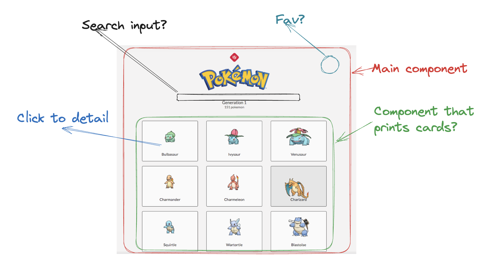

# Frontend-Pokemon-app 🐉🐉

Welcome to the Frontend-Pokémon-app! This application allows users to search for Pokémon using the public PokeAPI. Users on this app can Users can browse, search, star, and view details about Pokémon from the first 151 (first generation).
  (first generation) and pick one, or search manually for one Pokémon in particular by its name, and through a user-friendly interface, data about the Pokémon will be displayed. Users can also save their favorite Pokémons (and remove them) from their list of favorites and view the list of favorites.

## Viewport recomendation 📱

- The styles in this application have been designed for mobile first but it is fully responsive.

## Features 📦

- Users can scroll through a list of the first 151 Pokémons.
- Users can easily add or remove Pokémons on this list to their favorites.
- Users can see more details on each Pokémon by clicking on the list.
- Users can use the search bar to look up a specific Pokémon (always from the first generation) by its name.
- Users can view their selected favorite Pokémons. They can also click on them to see more details.

**Data Display** 

The app can display the following information about the Pokémon:
- Image (gif)
- Name
- Pokémon ID
- Type or Types
- Height
- Abilities

## Technologies Used 💻

- React
- JavaScript
- CSS
- Postman (for API exploration)
- Axios (for making API requests)
- Jest
- ESlint

##### <em>Initial schematic representation of the app (pre-development):</em>

## How to Start 🏃‍♂️

To run this application locally, follow these steps:

1. Clone this repository.
2. Navigate to the project directory: `cd frontend-pokemon-app`.
3. Install the required dependencies: `npm install`.
4. Start the application: `npm start`.
5. Open your web browser and go to `http://localhost:3000` to view the app.

To test this application, use the script `npm run test`

## Views ##
| View              | Route       | Description                             |
|----------------------|----------------|-----------------------------------------|
| MainPage     | /pokemon       | Get all first generation Pokemons (151) |
| PokemonDetail | /pokemon/{name} | Get a specific Pokemon                  |
| Favorites     | /pokemon/favorites    | Get all favorite Pokemons (user's choice) |

## Notes 📝

- The main view ('/pokemon') makes an API call every time it renders. This decision was made because it's a quick and lightweight call, so it was simpler from a code perspective to make this call each time rather than making it once and storing it in local storage.

- I've chosen to create a utils folder to store methods that are repeated throughout the app, or that deal with logic that is not component-specific, aiming to keep the code organized.

- Since the aim of the project didn't include the creation of a database to store user favorite Pokémons, I've decided to store this information in the browser's local storage.

- About styles, I've made every effort to closely adhere to the provided requirements and replicate them faithfully.

- I've focused on creating components with reusability in mind.

## Improvements that could be made to the app 🚀

- Work on using WebPack (Work in Progress)
- Refactor the API calls. Create a pokémonService class that handles all the logic regarding the PokéApi, with various methods for each endpoint call, to remove such logic from the components.
- Adding a dynamic search feature that suggests matches as a name is entered into the search bar.
- Enhancing the user experience by improving the interface to include a "Pokémon Not Found" component style.
- Add more unit testing to achieve a higher code coverage.

It has really been a happy coding time! 💻

